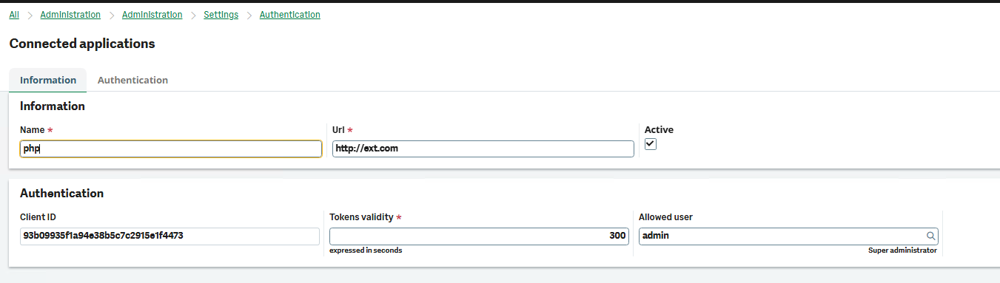
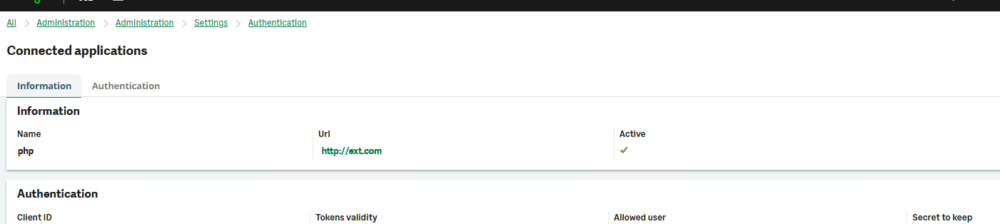
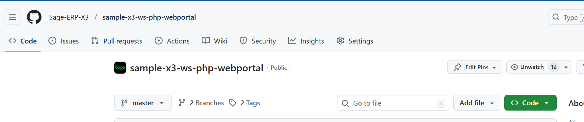
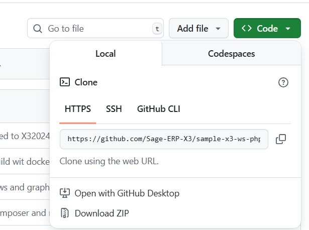
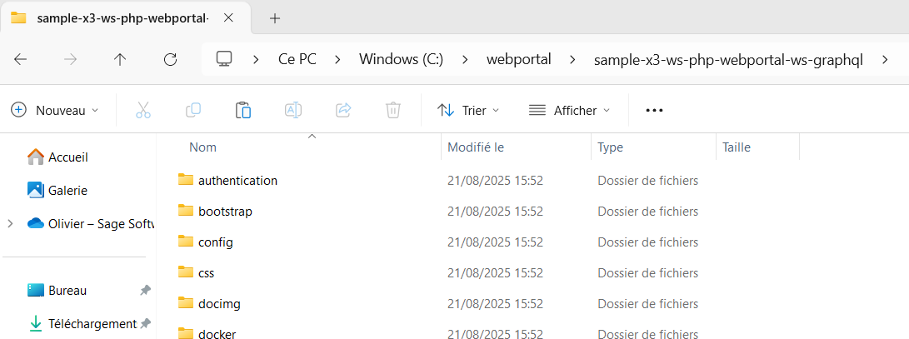
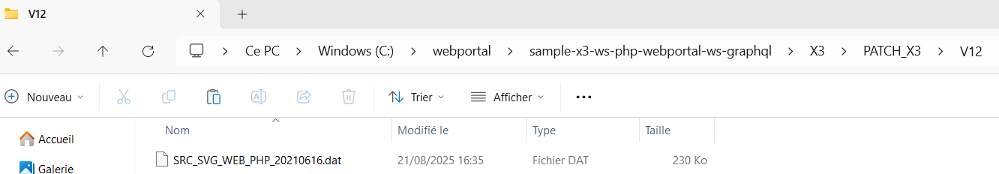
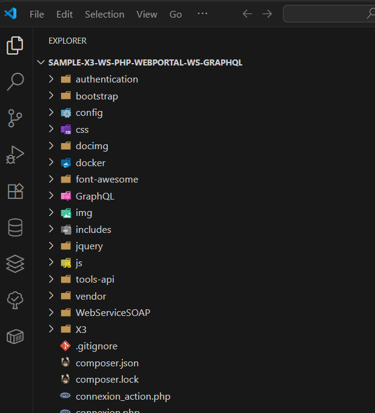
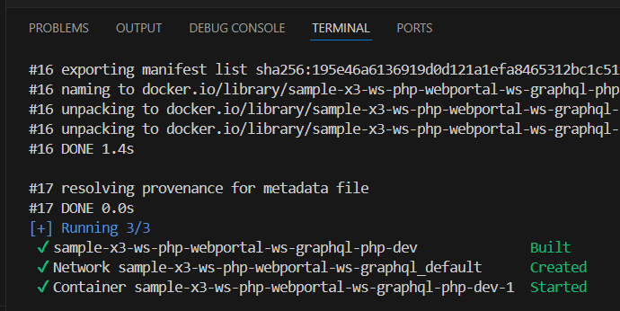
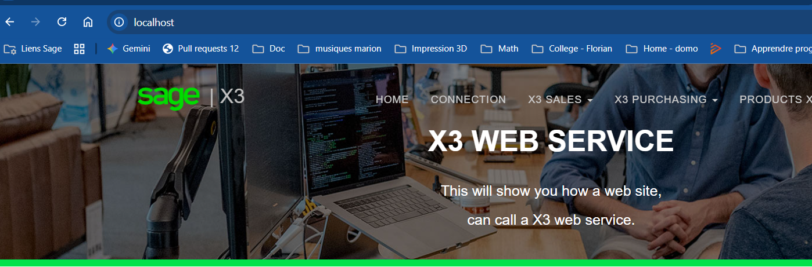

# PHP web portal connected with X3<!-- omit from toc -->

## Table of contents<!-- omit from toc -->

- [Minimal version Sage X3](#minimal-version-sage-x3)
- [Objectives](#objectives)
- [X3 Patch](#x3-patch)
- [Configure Connected applications in Sage X3](#configure-connected-applications-in-sage-x3)
- [How execute this Web Portal ?](#how-execute-this-web-portal-)
  - [Option 1 - With the Web server **Wampserver**](#option-1---with-the-web-server-wampserver)
  - [Option 2 - with **Docker** on you local machine](#option-2---with-docker-on-you-local-machine)
    - [Prerequis on your local machine outside Sage X3](#prerequis-on-your-local-machine-outside-sage-x3)
    - [Install and configure the PHP Web portal](#install-and-configure-the-php-web-portal)
      - [Download the PHP web portal project files](#download-the-php-web-portal-project-files)
      - [Configure the portal](#configure-the-portal)
    - [Configure the X3 server and the pool of Web services](#configure-the-x3-server-and-the-pool-of-web-services)
    - [Install the X3 application patch](#install-the-x3-application-patch)
      - [Integrate X3 patch](#integrate-x3-patch)
      - [Publish the Web service](#publish-the-web-service)
      - [Execute the web portal with Docker](#execute-the-web-portal-with-docker)
      - [Stop the web portal with Docker](#stop-the-web-portal-with-docker)
- [Details](#details)
  - [Using Sage SOAP web services X3](#using-sage-soap-web-services-x3)
  - [Using New authentication **Connected applications**](#using-new-authentication-connected-applications)
  - [Using Sage GraphQL api](#using-sage-graphql-api)
    - [Use GraphQL queries with the UI graphql api](#use-graphql-queries-with-the-ui-graphql-api)
      - [GraphQL Query - mySpeList](#graphql-query---myspelist)
      - [GraphQL Mutation - mySpeCreate](#graphql-mutation---myspecreate)
    - [Description of GraphQl queries](#description-of-graphql-queries)
      - [Purchase orders](#purchase-orders)
        - [Query GraphQL - Operation X3 query ( for the list)](#query-graphql---operation-x3-query--for-the-list)
        - [Query GraphQL - Operation X3 read ( for the detail)](#query-graphql---operation-x3-read--for-the-detail)
      - [Purchase receipts](#purchase-receipts)
        - [Query GraphQL - Operation X3 query ( for the list)](#query-graphql---operation-x3-query--for-the-list-1)
        - [Query GraphQL - Operation X3 read ( for the detail)](#query-graphql---operation-x3-read--for-the-detail-1)
        - [Mutation GraphQL - Operation X3 create ( for the creation)](#mutation-graphql---operation-x3-create--for-the-creation)
  - [Using Web Sage design](#using-web-sage-design)
  - [Setup X3 only for SOAP web services](#setup-x3-only-for-soap-web-services)
  - [Features](#features)

## Minimal version Sage X3

For GraphQL : Sage X3 2023R2

## Objectives

The objective of this portal is to show an example **outside of Sage X3**
which uses **SOAP X3 web services** and **GraphQL api**.

- This is an example for **Presales or for developers**.
- This is **not** a portal to put **into production**.
- This portal is used for the **Bootcamp** on the Sage X3 web services offered by the **Sage COEX team**.

## X3 Patch

> Only **mandatory**  if you want test the SOAP web services.

## Configure Connected applications in Sage X3

> Administration > Administration > Settings > Authentication > Connected applications

New connected applications



Save

Detail

Regenerate secret



Copy the secret to keep in a text file

## How execute this Web Portal ?

> We have two options to execute this Web Portal     
> - Option 1 : with the Web server **Wampserver**
> - Option 2 : with **Docker** on your local machine

### Option 1 - With the Web server **Wampserver**

Execution with Wampserver

See [Create_a_WebPortal_SageX3_WebServices_ENG.pdf](./doc/pdf/Create_a_WebPortal_SageX3_WebServices_ENG.pdf)  

### Option 2 - with **Docker** on you local machine

#### Prerequis on your local machine outside Sage X3

- **Docker** installed
- **vscode** installed

#### Install and configure the PHP Web portal

> If you have not already done so, start the web service pool you just created. See steps in the previous section for details.

##### Download the PHP web portal project files

- The project file for the PHP web portal is available from GitHub. The project file is open to everyone, so you do not need a GitHub account. The download file contains everything you need to create and configure the portal including the **application X3 patch** for the YOSOH web service.

- From GitHub https://github.com/Sage-ERP-X3/sample-x3-ws-php-webportal/tree/ws-graphql, 
- Click Code / Download ZIP




Be sure to download the ZIP file.

Save the **sample-x3-ws-php-webportal-ws-graphql.zip** file to your local folder: **C:\webportal**.
Extract all files to **C:\webportal**.



##### Configure the portal

Next, you need to configure the portal to communicate with Sage X3.

In the folder**C:\webportal\config**, copy the file
 - **Config_template.php** file to
 - **Config.php**
  

The following fields should match what you entered when you configured your web service pool in Sage X3:

**Config.php**

-  WEB_SERVER_X3 : `X3 server url`
-  POOL_ALIAS : `Pool alias`
-  GQL_ENDPOINT : `Endpoint X3 for Grpahql API`
-  WEB_SITE_CONSOLE : `true`. To have Graphql request in the Browser console
-  JWT_CLIENT_ID : `Client id from configuration of connected applications`
-	 JWT_SECRET_OR_PRIVATE_KEY : `Secret from configuration of connected applications`
-  JWT_USER : `User from configuration of connected applications`
  
````php
<?php

class Config {

	/*
	 	Config Web server X3
	*/
	# no caracter "/" at the end.
	# "http://<name webserevr X3>/" Not right
	#public static $WEB_SERVER_X3 = "http://<name webserevr X3>";
	public static $WEB_SERVER_X3 = "http://<name webserevr X3>";

	/*
	 	Config SOAP Web services X3 
	*/

	public static $CODE_LANG       	= "ENG";
	public static $POOL_ALIAS      	= "...";
	public static $WS_ORDER  		= "YOSOH";
	public static $WS_STOCK  		= "YSTOCK_LOT";
	public static $WS_PRODUCT		= "YOITM";
	
	/*
	 	Config GraphQL X3
	*/

	public static $GQL_ENDPOINT 	= "...";

	/*
	 	Config PHP Web Portal
	*/

	public static $WEB_SITE_LOGIN	= "websage";
	public static $WEB_SITE_PASSWD 	= "websage";

	public static $WEB_SITE_CONSOLE = true;

	/*
	 	Config JWT
	*/
	
	public static $JWT_CLIENT_ID    			= "...";
	public static $JWT_SECRET_OR_PRIVATE_KEY    = "...";
	public static $JWT_AUDIENCE     			= "";
	public static $JWT_USER		    			= "...";
}
?>

````

- `WS_ORDER` : YOSOH The name of the Sales orders Web services.
- `WEB_SITE_LOGIN and WEB_SITE_PASSWD` represent the credentials you will share with those who will be accessing these web services via the web portal.


> Important! Do not change the punctuation and formatting.

#### Configure the X3 server and the pool of Web services

> **The pool of webservice** only mandatory for Soap Web services

Take into account the different parts in this document [Create_a_WebPortal_SageX3_WebServices_ENG.pdf](./doc/pdf/Create_a_WebPortal_SageX3_WebServices_ENG.pdf).           

- Configure the server and the pool of Web services

#### Install the X3 application patch

> **Mandatory** if you want test the SOAP Web services

##### Integrate X3 patch

You need to install the patch containing the YOSOH web services. The file was downloaded in the ZIP file from GitHub.
The name of file is SRC_SVG_WEB_PHP_YYYYMMDD_NN.dat. It is in the following directory: C:\webportal\sample-x3-ws-php-webportal-ws-graphql\X3\PATCH_X3\V12.



> **Important!** You can only install the patch on the SEED folder, not the application folder.

##### Publish the Web service

After installing the patch with the web service, you need to publish the service. This validates the web service so that it is visible.
In the application, navigate to Development > Script dictionary > Scripts and open Web services (GESAWE).
Cliquez sur Publication globale.


##### Execute the web portal with Docker

Open vscode on **C:\webportal\sample-x3-ws-php-webportal-ws-graphql**



Open new terminal

````
# Start Web portal server
$ docker compose up -d
[+] Running 2/2
 ✔ Network sample-x3-ws-php-webportal-ws-graphql_default      Created                                                   0.0s 
 ✔ Container sample-x3-ws-php-webportal-ws-graphql-php-dev-1  Started                                                   0.4s 

````



Open ./docker-compose.yml

we have ports:
      - 80:80

The second 80 is the port for http server. 
You can change

````yml
services:
  php-dev:
    build:
      context: ./docker/php
      dockerfile: Dockerfile
      target: dev-default
    volumes:
      - ./:/app
    ports:
      - 80:80
volumes:
  .:

````

Open Web server on http://locahost:80



##### Stop the web portal with Docker

````
# Stop Web portal server
$ docker compose down
[+] Running 2/2
 ✔ Container sample-x3-ws-php-webportal-ws-graphql-php-dev-1  Removed                                                   1.3s 
 ✔ Network sample-x3-ws-php-webportal-ws-graphql_default      Removed                                                   0.3s 
````

## Details

### Using Sage SOAP web services X3

- Sales orders for reading (List and Detail) and for writing into Sage X3
- Products for reading (List and Detail)
- Available Stock

### Using New authentication **Connected applications**

- No more authentication in **basic HTTP**
- Use of Standard **JSON Web Tokens** (JWT)

### Using Sage GraphQL api

- Purchasing orders ( List and Detail)
- Purchasing receipts ( List, Detail and **Creation**)

#### Use GraphQL queries with the UI graphql api

##### GraphQL Query - mySpeList


##### GraphQL Mutation - mySpeCreate


#### Description of GraphQl queries

##### Purchase orders

###### Query GraphQL - Operation X3 query ( for the list)

**myspelist** is a operation created for using parameters

```graphql
query mySpeList($first: Int!, $filter: String, $orderBy: String) {
  x3Purchasing {
    purchaseOrder {
      query(first: $first, filter: $filter, orderBy: $orderBy) {
        edges {
          node {
            _id
            purchaseSite {
              name
              _id
            }
            receiptSite {
              name
            }
            orderFromSupplier {
              code
            }
            internalOrderReference
            receiptStatus
            signatureStatus
            isClosed
          }
        }
      }
    }
  }
}
```

**GraphQl query variables**

```json
{
  "first": 50,
  "filter": "[{orderFromSupplier:{_id:'CN001'}},{purchaseSite:{_id:'FR011'}},{receiptStatus:'no'}]",
  "orderBy": "{purchaseSite:{_id:-1},_id:-1}"
}
```

###### Query GraphQL - Operation X3 read ( for the detail)

```graphql
query mySpeDetail($id: Id!) {
  x3Purchasing {
    purchaseOrder {
      read(_id: $id) {
        _id
        purchaseSite {
          name
          _id
        }
        receiptSite {
          name
        }
        orderFromSupplier {
          code
        }
        internalOrderReference
        receiptStatus
        signatureStatus
        isClosed
        _createStamp
        _updateStamp
        purchaseOrderQuantityLines {
          query {
            edges {
              node {
                lineNumber
                product {
                  code
                  description1
                }
                quantityInOrderUnitOrdered
                quantityInStockUnitReceived
                orderUnit {
                  code
                }
              }
            }
          }
        }
      }
    }
  }
}
```

**GraphQl query variables**

```json
{
  "id": "POFR0110113"
}
```

##### Purchase receipts

###### Query GraphQL - Operation X3 query ( for the list)

```graphql
query mySpeList($filter: String, $orderBy: String) {
  x3Purchasing {
    purchaseReceipt {
      query(filter: $filter, orderBy: $orderBy) {
        edges {
          node {
            id
            receiptSite {
              _id
              name
            }
            receiptDate
            supplier {
              _id
            }
          }
        }
      }
    }
  }
}
```

**GraphQl query variables**

```json
{
  "filter": "{lines:{_every:true,purchaseOrder:'POFR0110113'}}",
  "orderBy": "{id:-1}"
}
```

###### Query GraphQL - Operation X3 read ( for the detail)

```graphql
query mySpeDetail($id: Id!) {
  x3Purchasing {
    purchaseReceipt {
      read(_id: $id) {
        id
        receiptSite {
          _id
          name
        }
        receiptDate
        supplier {
          _id
        }
        lines {
          query {
            edges {
              node {
                _sortValue
                _id
                lineNumber
                purchaseOrder
                purchaseOrderLineNumber
                purchaseOrderSequenceNumber
                quantityInReceiptUnitReceived
              }
            }
          }
        }
      }
    }
  }
}
```

**GraphQl query variables**

```json
{
  "id": "RECFR0110094"
}
```

###### Mutation GraphQL - Operation X3 create ( for the creation)

```graphql
mutation mySpeCreate($data: PurchaseReceipt_Input!) {
  x3Purchasing {
    purchaseReceipt {
      create(data: $data) {
        id
      }
    }
  }
}
```

**GraphQl query variables**

```json
{
  "data": {
    "receiptSite": "FR011",
    "receiptDate": "2021-08-05",
    "supplier": "CN001",
    "lines": [
      {
        "receiptSite": "FR011",
        "purchaseOrder": "POFR0110112",
        "purchaseOrderLineNumber": "1000",
        "product": "DIS012",
        "receiptUnit": "UN",
        "quantityInReceiptUnitReceived": "10",
        "stockDetails": {
          "status": "A",
          "packingUnit": "UN",
          "quantityInPackingUnit": "10"
        }
      },
      {
        "receiptSite": "FR011",
        "purchaseOrder": "POFR0110112",
        "purchaseOrderLineNumber": "2000",
        "product": "DIS013",
        "receiptUnit": "UN",
        "quantityInReceiptUnitReceived": "20",
        "stockDetails": {
          "status": "A",
          "packingUnit": "UN",
          "quantityInPackingUnit": "20"
        }
      }
    ]
  }
}
```

### Using Web Sage design

    ...to complete

### Setup X3 only for SOAP web services

- Unzip V12.zip in X3/PATCH_X3
- Install patch X3 SRC_SVG_WEB_PHP_YYYYMMDD_NN from X3/PATCH_X3/V12
- Publish the web services YOSOH, YOITM and YSTOCK_LOT

### Features

- PHP source
- No X3 sources
- X3 specific patch for the SOAP web services
