Create a web portal

Using Sage X3 web services

Update 10

15 06 16

The purpose of this document is to explain how to invoke SOAP X3 Web services from a web portal in PHP.

The portal gives you access to your data in Sage X3 such as orders or customer information in real-time. You do not need to share large files across networks or via email. Because the data stays in X3, not saved out to an external server, it is more secure. Remote employees like sales professions can not only view data, but they can also create new data such as sales orders from any computer with internet access via a browser.

You can create the portal using Sage X3 SOAP web services functionality and WampServer® is a Windows web development environment that allows you to create web applications with Apache2, PHP, and a MySQL database. In addition, PhpMyAdmin allows you to easily manage your databases. \[Source: wampserver.com\].

Audience

This document is intended for experienced Sage X3 users with administrator level permissions who may or may not have prior experience with publishing web services. There is also a section specifically for developers who have advanced coding and web services knowledge.

**
**

June 2016

Requirements

To build the PHP web portal, you need the following:

-   Windows 64 bit operating system

-   Sage X3 9.0.2 or above

-   Microsoft Visual C++ 2012 Redistributable (x64)

Install Microsoft Visual C++ 2012 Redistributable (x64)

From <https://www.microsoft.com/en-US/download/details.aspx?id=30679>

Select your language from the pull-down menu and click **Download**.

There are multiple files available for this download. When prompted, select **VSU\_4/vcredist\_x64.exe**.

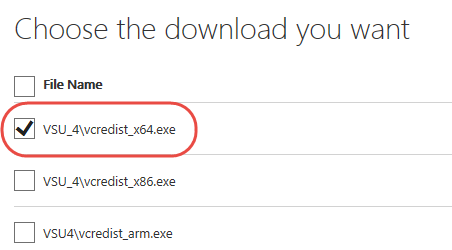

Build the portal

Install and configure WampServer

You can download WampServer from [www.wampserver.com](http://www.wampserver.com). On the homepage, scroll down and download this one:

**WAMP SERVER (64 BITS & PHP 5.5) 2.5 **

By default, WampServer installs to **c:\\sage\\wamp**, but you can select a different folder when prompted.

Next, you need to choose a default browser such as Chrome or IE.

Navigate to the EXE file on your computer.

Select the file and click Open.

Examples for IE and Chrome are shown below.

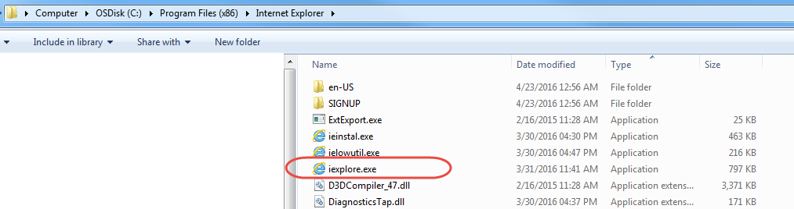

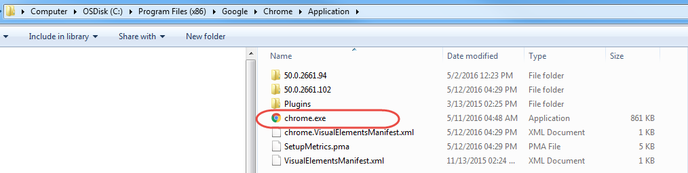

You need to change the default http port, which is **80**. You can, for example, change it to **8125**, or to another port.

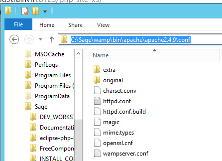

Navigate to **c:\\Sage\\wamp\\bin\\apache2.4.9\\conf\\**

In Notepad ++, open **httpd.conf** and edit the file as follows:

\#

\# Listen: Allows you to bind Apache to specific IP addresses and/or

\# ports, instead of the default. See also the &lt;VirtualHost&gt;

\# directive.

\#

\# Change this to Listen on specific IP addresses as shown below to

\# prevent Apache from seizing all bound IP addresses.

\#

\#Listen 12.34.56.78:80

Listen \[::0\]:8125

Save this file and restart all services for WampServer.

Right-click the WampServer icon on your desktop or taskbar, and select **Restart All Services**.

**Note**: You can use this same menu to start and stop all services for WampServer at any time.

Leave **All Services Running** while you set up the portal.

Configure the X3 server and the pool of X3 Web service

In Sage X3, complete follow these steps.

Note: the Host name etc. are examples. You might have other names.

Open Administration &gt; Administration &gt; Servers &gt; **Hosts**.

Click the edit icon next to your host name.

On the next screen, in the **Number of Web service child processes** field, enter **1**.

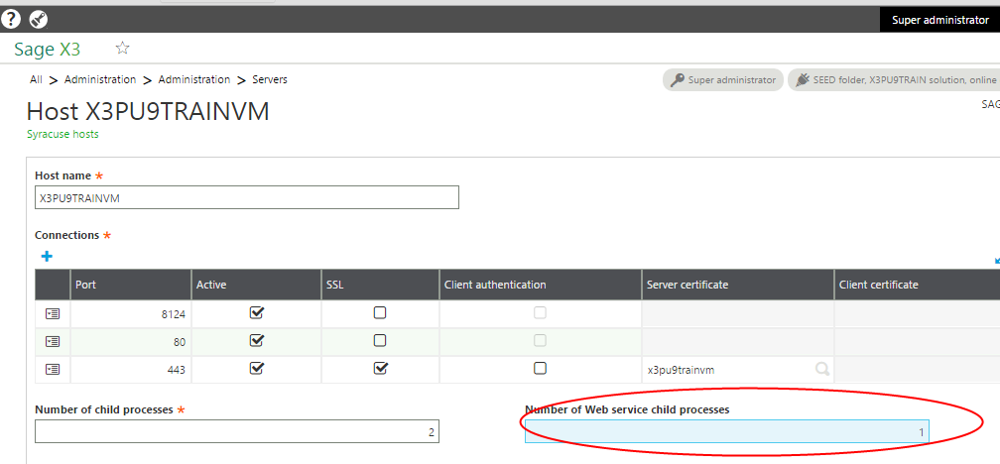

Open **Classic SOAP pools configuration** from Administration &gt; Administration &gt; Web Services.

Click **Create soapClassicPool**.

Complete the following fields:

**Alias**: Enter the name of the pool to be used in the web service call.

**Initialization size**: Enter **1**.

> Represents the number of clients (per node.js process) that are initialized during the pool startup.

**Maximum size**: Enter 1.

> Represents the maximum number of clients (per node.js process) that can be started on this pool.

**Auto start**: Leave unchecked.

> If checked, the pool starts when the Syracuse server starts.

**X3 server TAGS**: Leave blank.

> This field is best used by Developers with classic SOAP pool configuration.

**Endpoint:** Enter the endpoint (folder) to be used for web service requests.

**Locale:** Enter your language and location. (In this example, English.)

**User:** Enter the user name. In this case **Admin**.

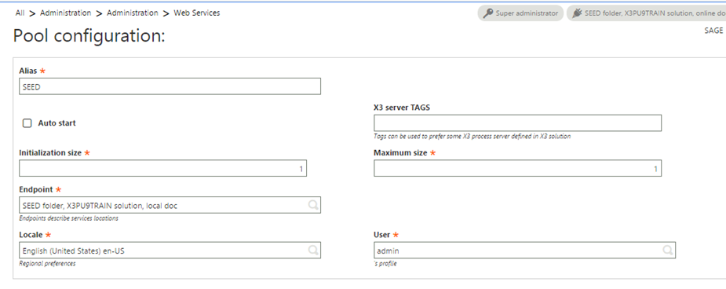

To continue setting up the PHP web portal, you need to start the pool.

After you create the pool based on the previous steps, it displays in the list of soapClassicPools.

Click the name of the pool you just created.

From the right panel, click **Start/Update**.

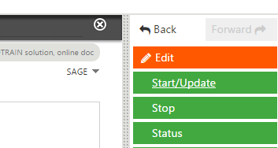

Install and configure the PHP Web portal

If you have not already done so, start the web service pool you just created. See steps in the previous section for details.

Download the PHP web portal project files

The project file for the PHP web portal is available from GitHub. The project file is open to everyone, so you do not need a GitHub account. The download file contains everything you need to create and configure the portal including the X3 patch for the YOSOH web service.

From GitHub <https://github.com/Sage-ERP-X3/sample-x3-ws-php-webportal>, click **Download**.

If you are logged in to GitHub, you have the option to Clone or download.

Be sure to download the ZIP file.

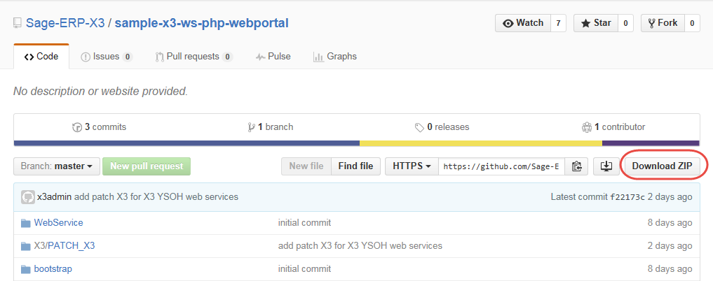

Save the **sample-x3-ws-php-webportal-master.zip** file to **C:\\Sage\\wamp\\www**.

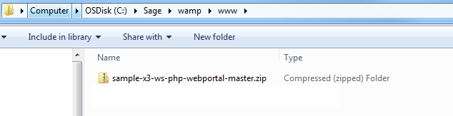

Extract all files to **C:\\Sage\\wamp\\www\\sagex3**.

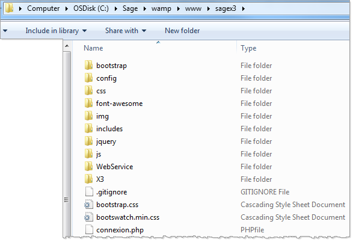

Configure the portal

Next, you need to configure the portal to communicate with Sage X3.

In the folder **C:\\Sage\\wamp\\www\\sagex3\\config**, open the **Config.php** file.

The following fields should match what you entered when you configured your web service pool in X3:

WSDL Your X3 server URL

CODE\_LANG

POOL\_ALIAS

> WS\_ORDER YOSOH for orders, is just for this example. You might set up a different web service.
>
> WEB\_SITE\_LOGIN and WEB\_SITE\_PASSWD represent the credentials you will share with those who will be accessing these web services via the web portal.

&lt;?php

class Config {

public static $WSDL = "http://x3pu9trainvm:8124/soap-wsdl/syracuse/collaboration/syracuse/CAdxWebServiceXmlCC?wsdl";

public static $CODE\_LANG = "ENG";

public static $CODE\_USER = "admin";

public static $PASSWORD = "admin";

public static $POOL\_ALIAS = "SEED";

public static $REQUEST\_CONFIG = "adxwss.optreturn=XML";

public static $WS\_ORDER = "YOSOH";

public static $WEB\_SITE\_LOGIN = "websage";

public static $WEB\_SITE\_PASSWD = "websage";

}

?&gt;

Do not change the punctuation and formatting.

From the WampServer menu**, Restart All Services.**

Enter the URL for your portal in your default browser. In this example the URL is <http://x3pu9trainvm:8125/sagex3/>

This is the name of X3 Syracuse server and the number was configured in **httpd.conf**.

This is an example of what your portal could look like.

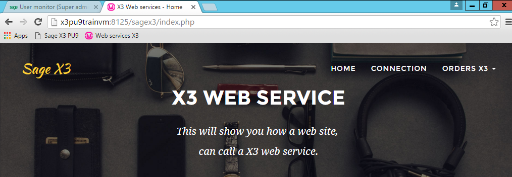

Install the X3 patch

You need to install the X3 patch containing the YOSOH web services. The file was downloaded in the ZIP file from GitHub.

The name of file is **SRC\_SVG\_WEB\_PHP\_YYYYMMDD\_NN.dat** and it is located in the following directory: C:\\Sage\\wamp\\www\\X3\\PATCH\_X3.

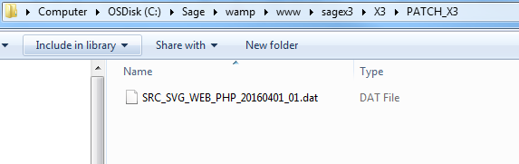

**Important! You can only install the patch to the SEED folder, not to the X3 folder.**

The patch contains the following X3 objects:

|          |                        |                                                                   |
|----------|------------------------|-------------------------------------------------------------------|
| **Type** | **Objects**            | **Comments**                                                      |
| ACV      | YSWPH                  | Activity code PHP Web portal                                      |
| EXE      | SUBSLC                 | Generate Sales entry transaction                                  |
| TRT      | YSWPHPSTOCK            | Script Available stock                                            |
| ASU      | YSWPHPSTOCK~STOCK      | Sub program YSWPHPSTOCK~STOCK Available stock                     |
| AWE      | YOSOH                  | Web service YOSOH Sales orders                                    |
| AWE      | YSSTOCKPHP             | Web service YSSTOCKPHP Available stock                            |
| SLT      | STRTYP=2 & STRNUM='WS' | Sales entry transaction WS: Web service for the web service YOSOH |

The web service ‘Available stock’ is not yet used at this moment.

Publish the web service

After installing the patch with the web service, you need to publish the service. This validates the web service so that it is visible.

In X3, navigate to Development &gt; Script dictionary &gt; Scripts and open **Web services** (GESAWE).

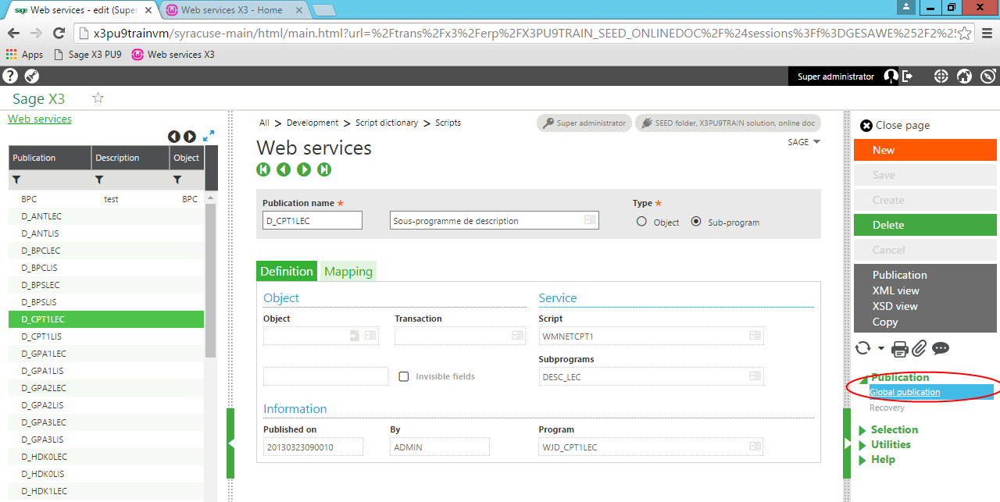Click **Global publication**.

Use the portal

Now that the web service has been published, you can begin accessing Sage X3 data in real-time via the portal.

WampServer needs to be running to access the portal and Sage X3 services.

Access the portal

Using the default browser you set earlier, enter the URL for your web portal.

For this example, the URL is http://x3pu9trainvm:8125/sagex3.

Click **CONNECTION** and log in with the username and password you set up when configured the portal.

**Note**: It is not required to be logged in to the portal to view orders.

Remember, because this web service is based on YOSOH for sales information, this portal provides access to orders in Sage X3.

From the **ORDERS X3** pull-down menu, select **LIST OF ORDERS**.

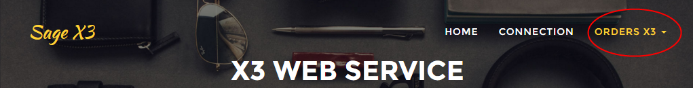

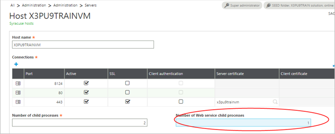

You can now see a list of current orders in your Sage X3 instance.

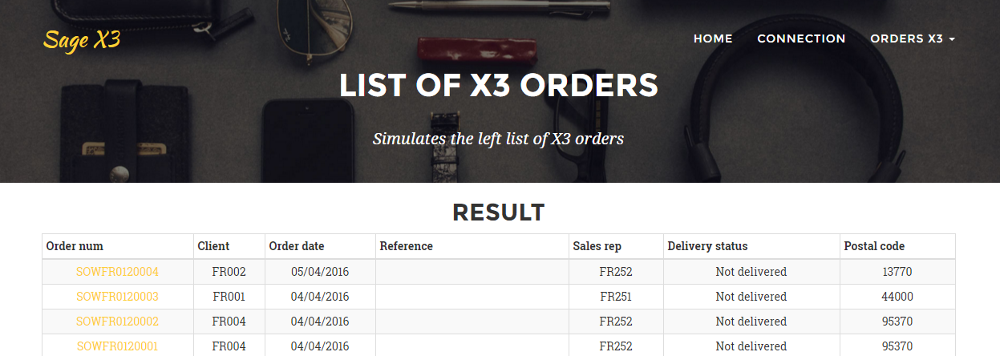

When you look at this data in Sage X3, you can see that it is the same.

Read an order

You can read orders by selecting from the list or by selecting **READ AN ORDER** from the **ORDERS X3** menu and entering the order number. For either method, you do not need to be logged in to the portal.

Click the order number for one of the orders in the list. This example uses order SOWFR0120004.

Clicking the order number or enter the order number provides detailed information about that order.

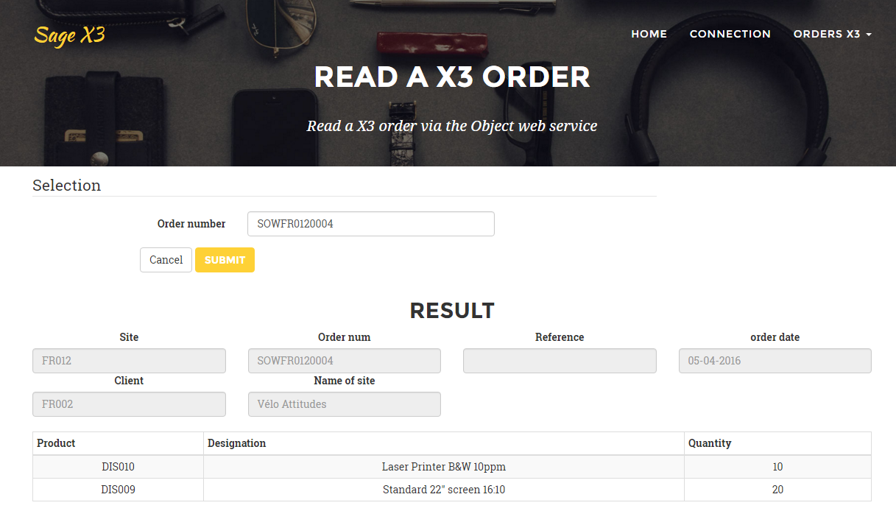

Create an order

You can create an order in X3 using the portal. You need to be logged in to the portal to do this.

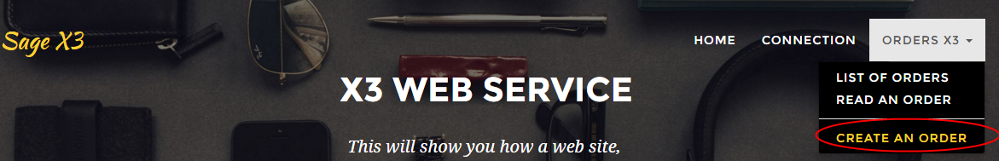

Remember, you defined the login and password for your portal in Config.php.

Open the file Config.php

need to connect to create an order; don’t need to login to view orders

&lt;?php

class Config {

…

public static $WEB\_SITE\_LOGIN = "websage";

public static $WEB\_SITE\_PASSWD = "websage";

}

?&gt;

Create an order

In addition to viewing orders, you can create a new order through the portal.

**Note**: To create a new order, you need to be logged in to the portal.

From the **ORDERS X3** pull-down menu, select **CREATE AN ORDER**.

Enter the relevant information as you would if you were working directly in Sage X3 and click **Submit**.

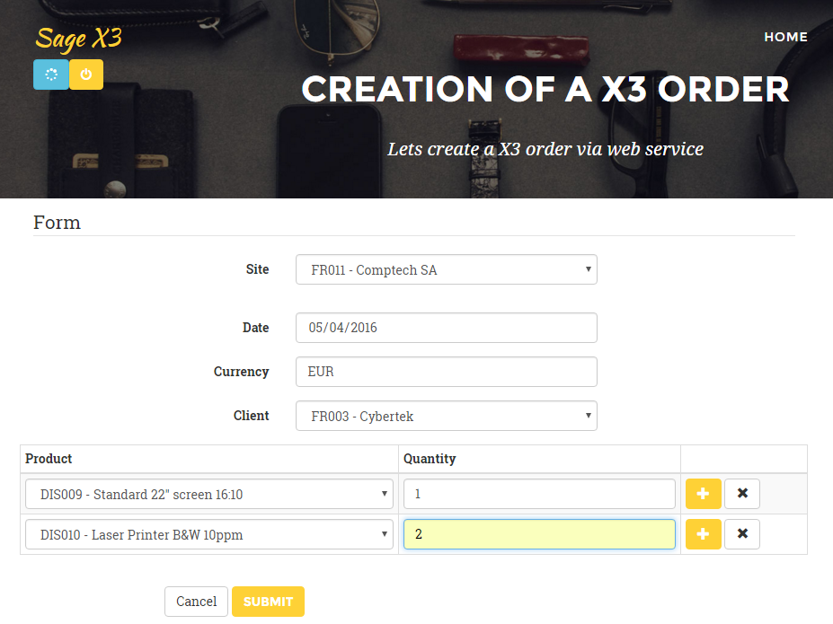

When the order has been created, click the oder number to view details.

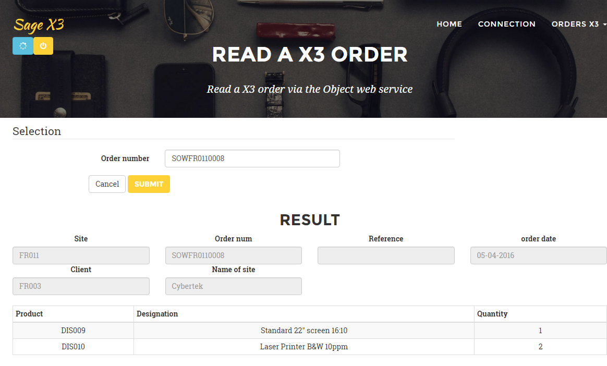

In Sage X3 entry transaction WS, you can see the same order.

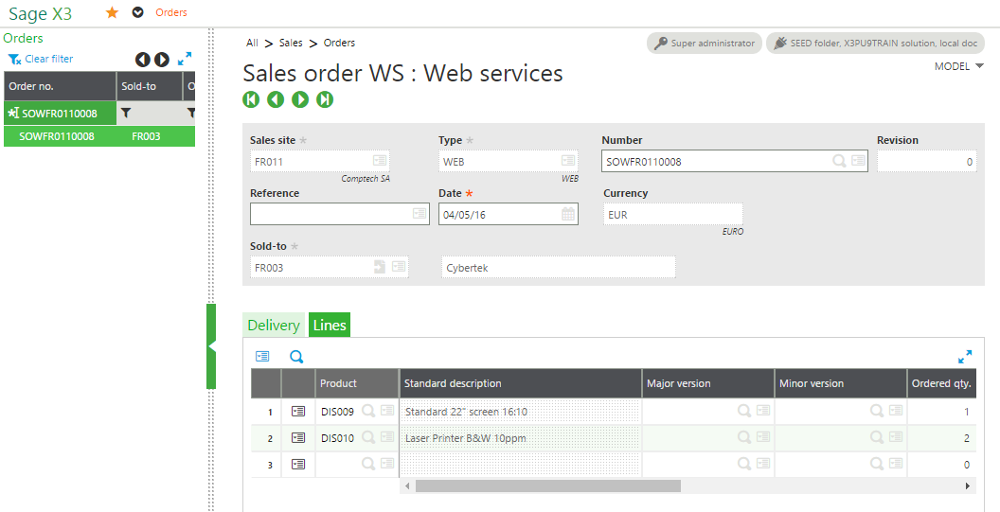

For developers

This section provides details specifically for developers who have advanced coding and web services knowledge. It uses the same YOSOH web service as an example.

This describes how to initiate these calls without the external application, but instead with the X3 test tool. It also shows the PHP or C\# codes that call the same X3 web services.

This web service is an object web service with the optimized transaction WS.

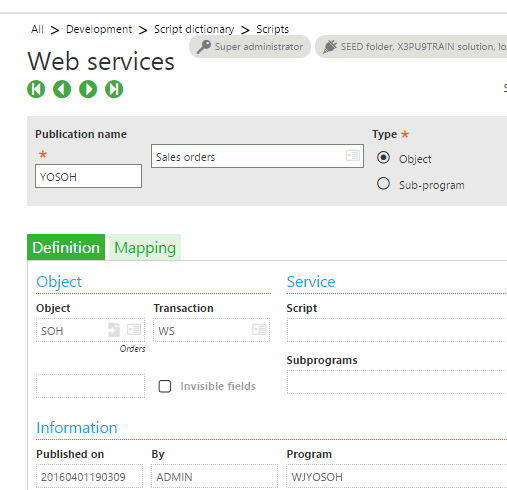

List the orders

**In the PHP code: **

Remember, the name of the X3 web service Order is SOH.

Config::$WS\_ORDER YSOH

In /sagex3/page\_soh\_list.php

&lt;?php

**require\_once** ('WebService/models/Order.php');

**try** {

$order = new Order ();

echo ($order-&gt;showListe ());

} **catch** ( SoapFault $e ) {

ToolsWS::*printError* ( "X3 Web service not available" );

}

?&gt;

**In /sagex3/WebService/models/Order.php**

**function** showListe() {

$WS = "\*";

$this-&gt;CAdxResultXml = $this-&gt;query ( Config::*$WS\_ORDER*, $WS,100);

…

}

**In the X3 tool:**

Navigate to Administration &gt; Administration &gt; Web Services and select **Classic SOAP Web Services**.

From the list of SOAP Generic Web Services, select this web service.

On the next screen, click the down arrow to see the list of Operations.

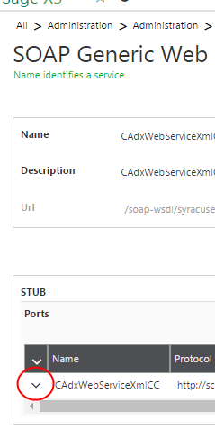

From the list of Operations, click **query**.

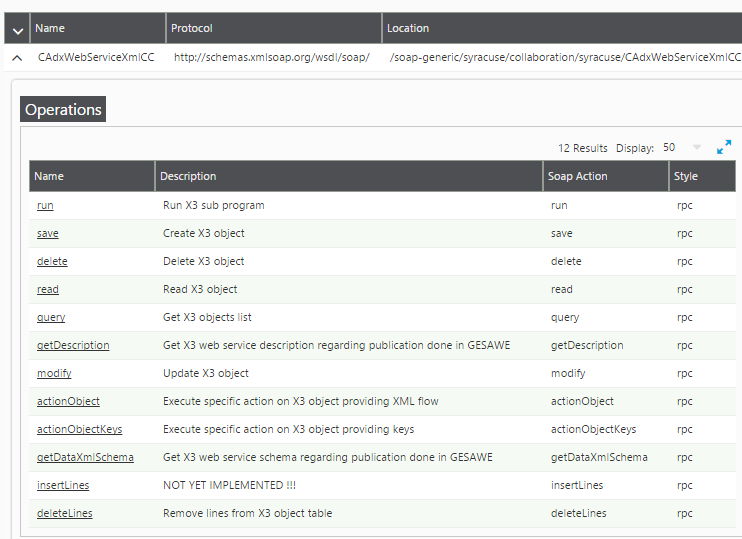

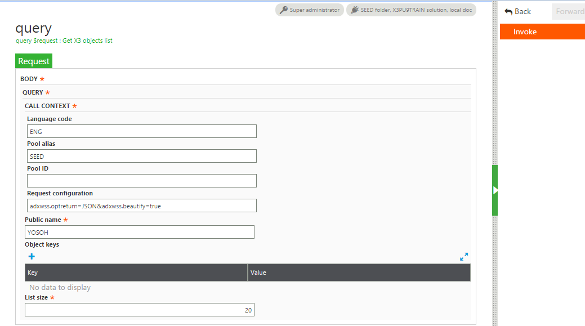

The request configuration

adxwss.optreturn=JSON&adxwss.beautify=true

means

adxwss.optreturn=JSON

The output data format is JSON or XML, where

adxwss.beautify=true

This action improves the presentation as shown below.

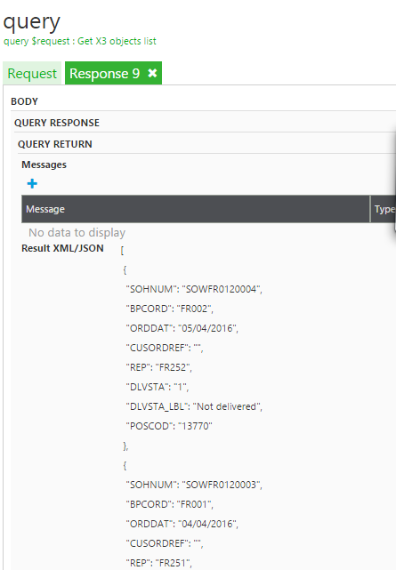

The web service is working without error when the status is 1.

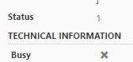There are only two status possibilities:

-   1 = OK

-   0= ERROR

Read an order

**In the PHP code:**

**In /sagex3/page\_soh\_read.php**

&lt;?php

…

echo ($order-&gt;showOne ( $sohnum ));

…

?&gt;

**In /sagex3/WebService/models/Order.php**

**function** showOne($crit) {

…

$cle = **new** CAdxParamKeyValue ();

$cle-&gt;key = "SOHNUM";

$cle-&gt;value = $crit;

$this-&gt;CAdxResultXml = $this-&gt;read (Config::*$WS\_ORDER*,Array($cle));

**…**

}

**In the X3 tool:**

You must call the Read operation with the key of the order.

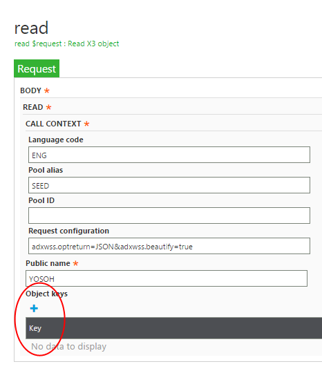

After selecting **Invoke**

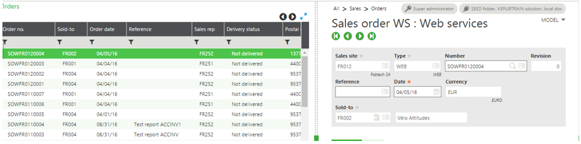

Create an order while logged in

**Using the X3 tool**:

At first you can copy the result of the JSON data from the read:

{

"SOH0\_1": {

"SALFCY": "FR011",

"ZSALFCY": "Comptech SA",

"SOHTYP": "WEB",

"ZSOHTYP": "WEB",

"SOHNUM": " SOWFR0110009 ",

"REVNUM": "0",

"CUSORDREF": "",

"ORDDAT": "20160406",

"CUR": "EUR",

…

Replace the line: "SOHNUM": " SOWFR0110009 ", with "SOHNUM": " ",

In the X3 tool, enter this data into the **Object Xml** field.

**Invoke**

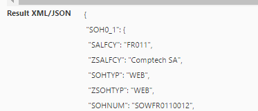

The code for the order that was created is in the JSON result:

The status have the value 1.

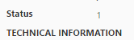

**PHP code:**

**In /sagex3/page\_soh\_create\_action.php**

&lt;?php

…

try {

$order = new Order ();

echo ($order-&gt;create ( $WS ));

} catch ( SoapFault $e ) {

ToolsWS::*printError* ( "X3 web service not available" );

}

…

?&gt;

**In /sagex3/WebService/models/Order.php**

**function** create($WS) {

$this-&gt;CAdxResultXml = $this-&gt;save ( Config::*$WS\_ORDER*, $WS );

…

}

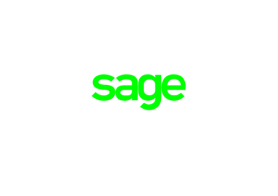
